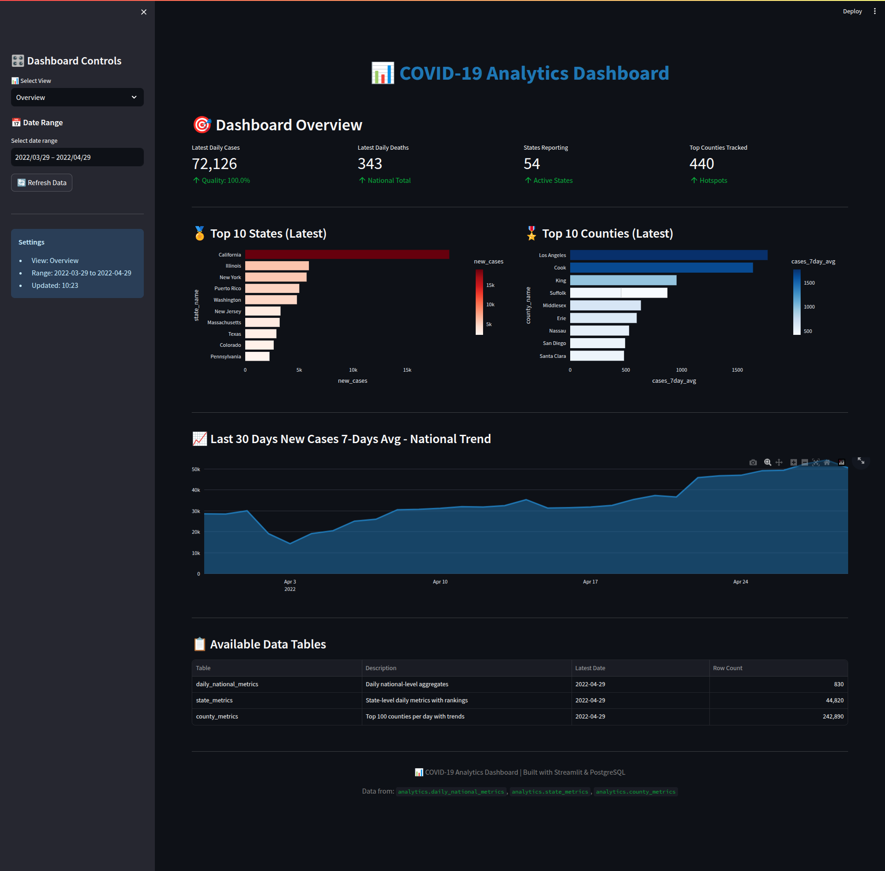
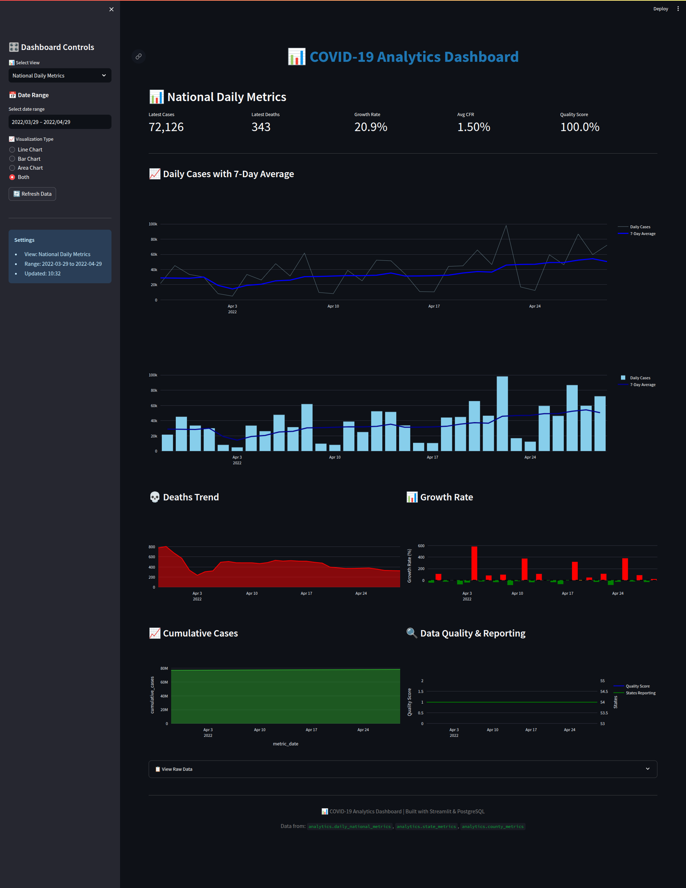
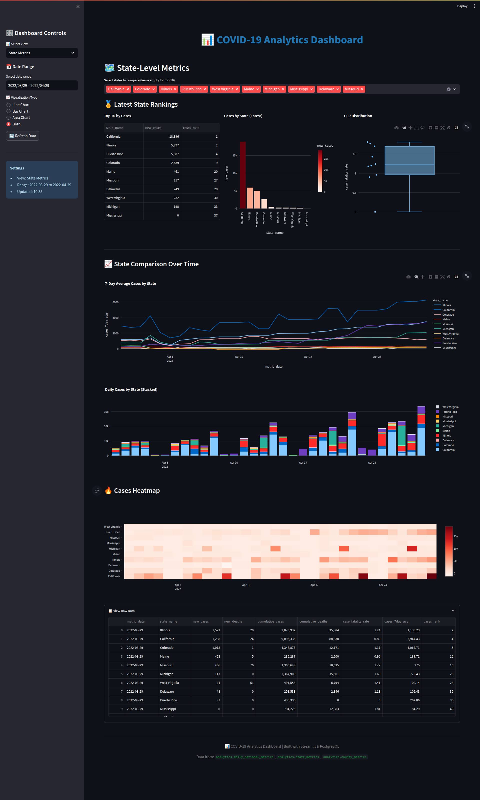
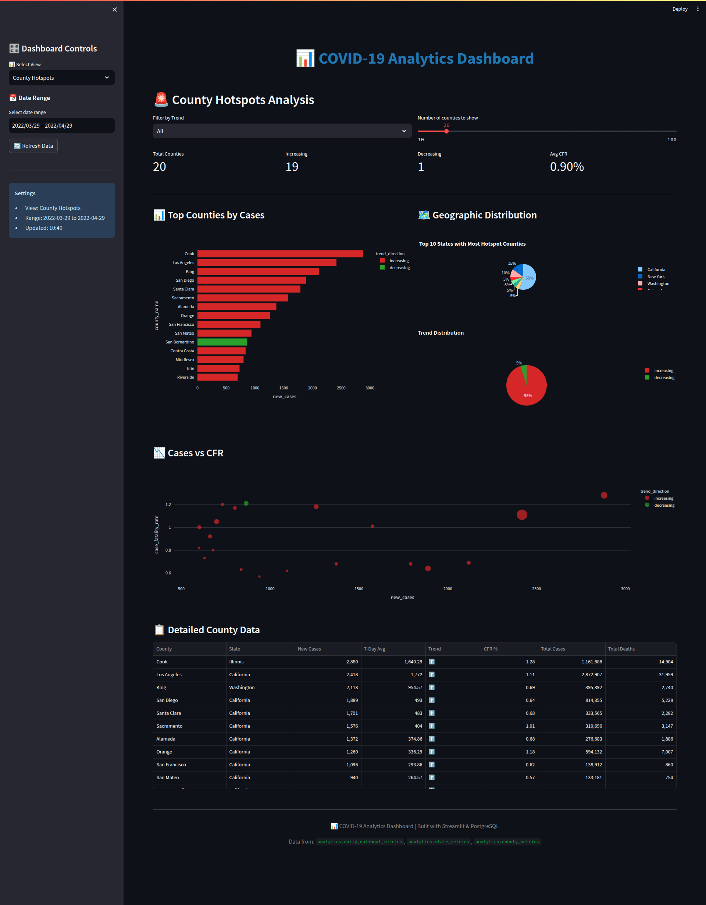

## Project Setup

Follow these steps to set up the project and run all services for data pipeline and dashboard.

### 1. Clone the Project

```bash
git clone https://github.com/mohsenklntri/mofid-code-challenge.git
cd mofid-code-challenge
```


### 2. Configure Environment Variables
Create a copy of the sample environment file:

```bash
cp .env.sample .env
```
Open `.env` and fill in all required values, including credentials and database connection details.
Don't Change `AIRFLOW_PROJ_DIR` and `POSTGRES_HOST`.


### 3. Data initialization

```bash
mkdir -p data/raw
```
download csv raw data source and extract zip file and locat csv file in this exact path `data/raw/covid-data.csv`

### 4. Start the Services
Build and start all services using Docker Compose:

```bash
docker compose up --build
```

### 5. Access Services GUI
Once the services are up, open the Airflow web interface at:

```arduino
http://localhost:8080
```
Login using the username and password you set in the `.env` file.

And you can visit interactive dashboard web interface at:

```arduino
http://localhost:8501
```
* For full technical details visit `document.pdf` or `document.md` file.

## Dashboard Sample Images

Images of the various pages of dashboard are available in the repository:

- Overview Page
  


- Daily National Metrics Page
  


- State Metrics Page
  


- County Hotspots Analysis Page
  



## COVID-19 Analytics Dashboard - Documentation

### Overview

An interactive **Streamlit-based dashboard** that visualizes COVID-19 analytics data from PostgreSQL. The dashboard provides real-time insights across multiple organizational levels (Executive, Tactical, Operational) through 4 distinct views.

**Technology Stack:**
- **Frontend**: Streamlit 1.31.0
- **Visualization**: Plotly 5.18.0 (interactive charts)
- **Backend**: PostgreSQL 15+ (analytics schema)
- **Deployment**: Docker Compose

**Access URL**: `http://localhost:8501`

## Dashboard Views

### 1. Overview

**Purpose**: High-level summary across all analytics tables

**KPI Metrics** (4 cards):
- Latest Daily Cases (with data quality score)
- Latest Daily Deaths
- States Reporting
- Top Counties Tracked


**Use Case**: Quick health check, system status verification

---

### 2. National Daily Metrics

**Purpose**: National-level trend analysis with multiple visualization options

**KPI Metrics** (5 cards):
- Latest Cases
- Latest Deaths
- Growth Rate (% change)
- Average CFR
- Quality Score

**Use Case**: Daily operations, trend monitoring, quality assurance

---

### 3. State Metrics

**Purpose**: Multi-state comparison and ranking analysis

**State Selector**:
- Multi-select dropdown (choose specific states)
- Default: Top 10 states by latest cases
- Enables custom comparisons

**Use Case**: State-level resource allocation, regional comparison, policy impact analysis

---

### 4. County Hotspots

**Purpose**: Identify and monitor high-risk counties with trend analysis

**Summary Metrics** (4 cards):
- Total Counties (in current selection)
- Increasing Trend Count (inverse delta color)
- Decreasing Trend Count (normal delta color)
- Average CFR

**Use Case**: Hotspot detection, targeted interventions, early warning system, outbreak tracking

## User Guide

### Navigation

1. **Select View** (sidebar dropdown)
   - Choose between 4 views

2. **Set Date Range** (sidebar calendar)
   - Pick start and end dates
   - Defaults to all available data

3. **Choose Visualization** (for National/State views)
   - Line, Bar, Area, or Both

4. **Apply Filters** (County view)
   - Trend direction
   - Number of counties

5. **Refresh Data** (sidebar button)
   - Clears cache
   - Fetches latest from database
